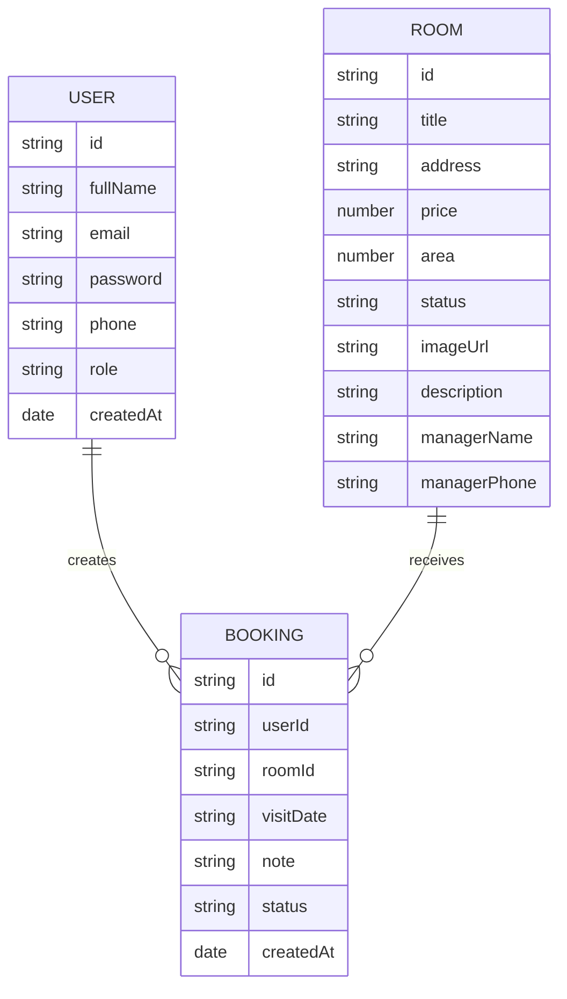

# So do co so du lieu

```mermaid
erDiagram
    USER ||--o{ BOOKING : creates
    ROOM ||--o{ BOOKING : receives

    USER {
        string id
        string fullName
        string email
        string password
        string phone
        string role
        date createdAt
    }

    ROOM {
        string id
        string title
        string address
        number price
        number area
        string status
        string imageUrl
        string description
        string managerName
        string managerPhone
    }

    BOOKING {
        string id
        string userId
        string roomId
        string visitDate
        string note
        string status
        date createdAt
    }
```

## Giai thich

- Mot `User` co the tao nhieu `Booking`
- Mot `Room` co the duoc nhieu nguoi dat lich xem
- `Booking` la bang trung gian noi `User` va `Room`
